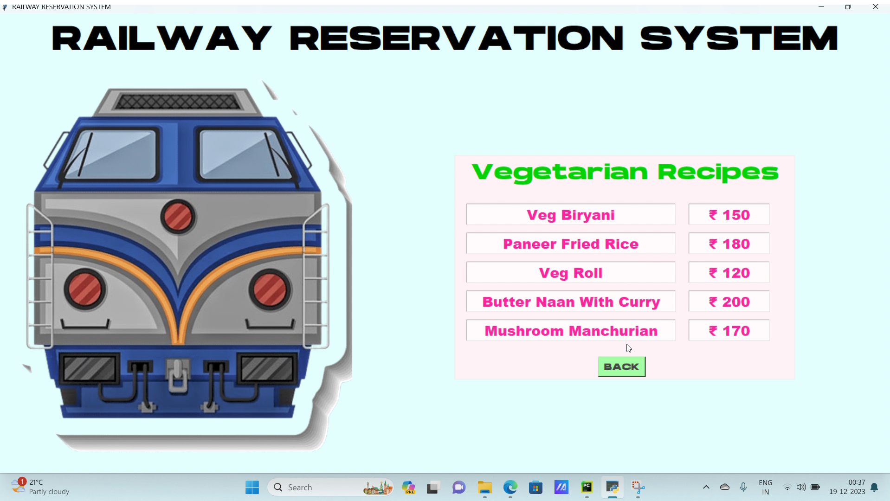

# Railway Reservation System - Mini Project 🚆

## Overview
This mini-project is a **Railway Reservation System** built using **Python**.

### Key Features:
- **Ticket Booking**: Users can book tickets for trains by entering their details.
- **Ticket ID Generation**: The system generates a unique ticket ID for each booking using the `Random` and `String` modules.
- **User-Friendly GUI**: The interface is designed using **Tkinter** for a seamless and intuitive user experience.
- **Image Display**: Images such as train pictures or logos are displayed using the **PIL** (Pillow) library.

## Technologies Used:
- **Python 3.x**
- **Tkinter**: For creating graphical user interface (GUI).
- **PIL (Pillow)**: For displaying images on the interface.
- **Random**: For generating random numbers (used in ticket ID generation).
- **String**: For string manipulation (used in ticket ID creation).

## 📸 Preview:
Here are some screenshots from the Railway Reservation System:

*Create New Account / Login*
  

*Creating New Account* 
  
 

*Dashboard*


*Trains Section*


*Book Ticket*


*Cancel Ticket*


*Error Handling*


*Meals Section*




*FAQ's Section*


## Project Requirements:
Before running this project, ensure you have the following installed:
- Python 3.x (Download it from [python.org](https://www.python.org/downloads/)).
- Tkinter (Usually comes pre-installed with Python, but if it's missing, install it using `pip install tk`).
- Pillow (Install using `pip install Pillow` for image-related functionalities).

## Installation:
1. Clone or download this repository to your local machine.
2. Ensure Python and the necessary libraries (Tkinter, PIL) are installed.
3. Run the script:
   ```bash
   python MINI_PROJECT.py